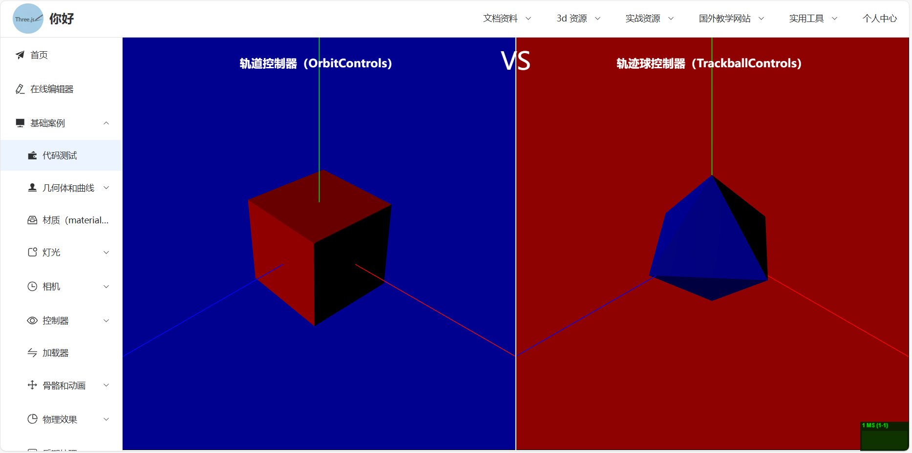

**[English](README.md)** <br>
**[中文](README_zh.md)**

<h1 style="text-align: center;color: #fd0000">three.js + vue3 Learning Case</h1>

## 在线预览：<a href="http://three.ailxy.icu/"></a>

## 1. Environment and Initialization
```
node: 20.14.0
npm install
npm run serve
npm run build
```

## 2. Project Introduction
<div>
  &nbsp;&nbsp;&nbsp;&nbsp;&nbsp;&nbsp;The purpose of creating this repository is to provide a complete set of learning resources for learners, helping everyone to quickly get started with three.js and master its basic concepts and functionalities.<br>
  &nbsp;&nbsp;&nbsp;&nbsp;&nbsp;&nbsp;The most useful part of this repository is the relevant resource links in the top navigation bar. It collects all the learning materials I've gathered since studying three.js, including a wealth of 3D assets and related tutorials.<br>
  &nbsp;&nbsp;&nbsp;&nbsp;&nbsp;&nbsp;To help you better understand and apply what you’ve learned, we provide numerous small examples. Each example focuses on a specific feature or effect, allowing you to quickly grasp various techniques of THREE.JS through hands-on practice. For instance, you can learn how to create and manipulate geometries, materials, lights, how to add animations and interactive effects to 3D scenes, and how to load and handle complex 3D models. 
  These projects cover a wide range of application scenarios, guiding you through the entire process of building a 3D application from scratch.
  In these practical projects, you can not only reinforce your knowledge but also enhance your project management and problem-solving skills. These projects will become important achievements for showcasing your skills and provide valuable references for actual development.
</div>




## 3. Declaration
This project is a collection of learning resources aimed at helping learners better understand related topics. Some resources in this project are sourced from the internet and may not be copyright protected. In this regard, I declare:

1. All external resources in this project are for non-commercial use only, intended for learning and research purposes.
2. If you are the copyright owner of any resource and wish for its removal, please contact me promptly, and I will address it as soon as possible.
3. This project does not bear any legal responsibility for the use of these resources.

Thank you for your attention and support for this project!

--- 
