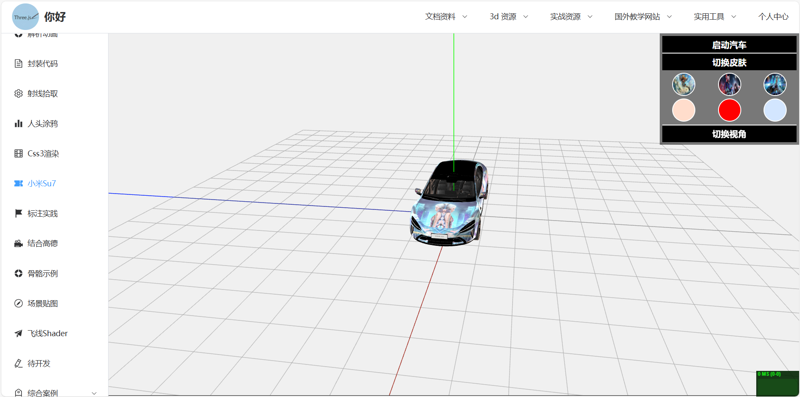
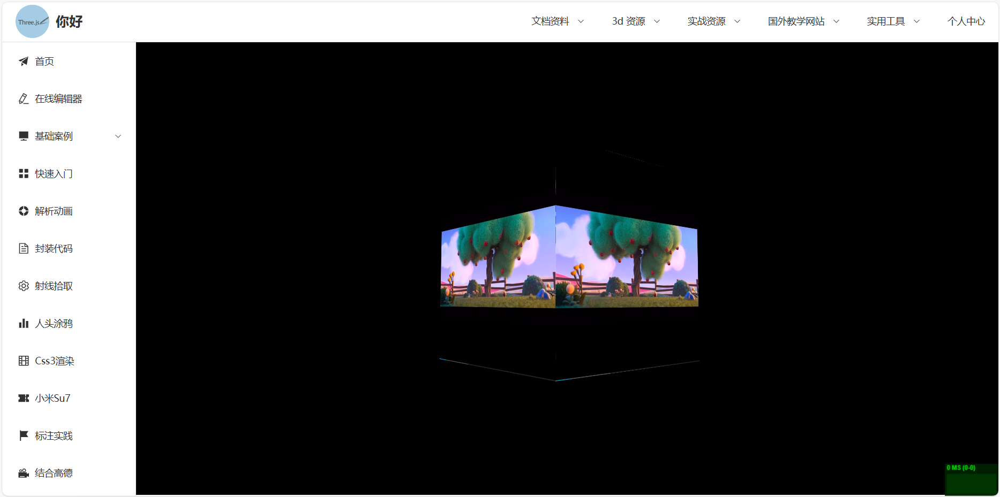

**[English](README.md)** <br>
**[中文](README_zh.md)**

<h1 style="text-align: center;color: #fd0000">three.js + vue3 学习案例</h1>

## 在线预览：<http://three.ailxy.icu/>

## 1.环境及初始化
```
node:20.14.0
npm install
npm run serve
npm run build
```

## 2.项目介绍
<div>
  &nbsp;&nbsp;&nbsp;&nbsp;&nbsp;&nbsp;创建本仓库的目的是为学习者提供一套完整的学习资源，帮助大家快速上手three.js，并掌握其基本概念和功能。<br>
  &nbsp;&nbsp;&nbsp;&nbsp;&nbsp;&nbsp;在该库中，最有用的还是顶部导航栏的相关资源链接。上面收集着我学习three.js以来所有的学习资料，不仅又大量3d素材及相关教程。<br>
  &nbsp;&nbsp;&nbsp;&nbsp;&nbsp;&nbsp;为了让你更好地理解和应用所学知识，我们提供了众多小案例。每一个案例都聚焦于特定的功能或效果，通过实际操作，你可以快速掌握THREE.JS的各种技巧。例如，
  你可以学会如何创建和操作几何体、材质、光源等，如何为3D场景添加动画和交互效果，如何加载和处理复杂的3D模型等。
  这些项目覆盖了从简单到复杂的各种应用场景，带你体验从零到一构建3D应用的全过程。
  在这些实战项目中，你不仅可以巩固所学知识，还能提升项目管理和问题解决的能力。这些项目将成为你展示自己技能的重要成果，也为你在实际开发中提供宝贵的参考。
</div>






## 3.声明
本项目是一个学习资源的集合，旨在帮助学习者更好地理解相关主题。项目中的部分资源来自互联网，未必拥有版权。在此，我声明：

1. 本项目中的所有外部资源均为非商业用途，仅供学习和研究使用。
2. 如果您是某个资源的版权拥有者，并希望我移除相关内容，请及时与我联系，我会尽快处理。
3. 本项目不承担因使用这些资源而可能导致的任何法律责任。

感谢您对本项目的关注与支持！
---

